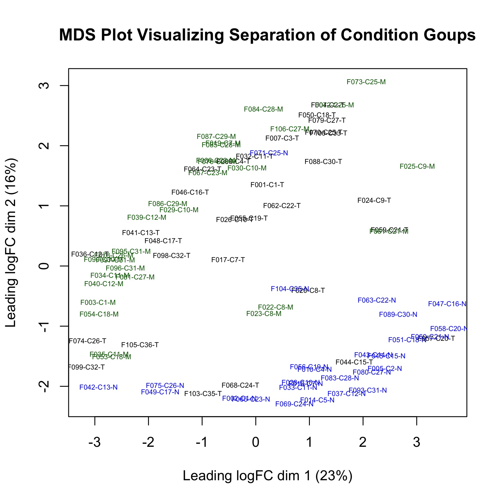
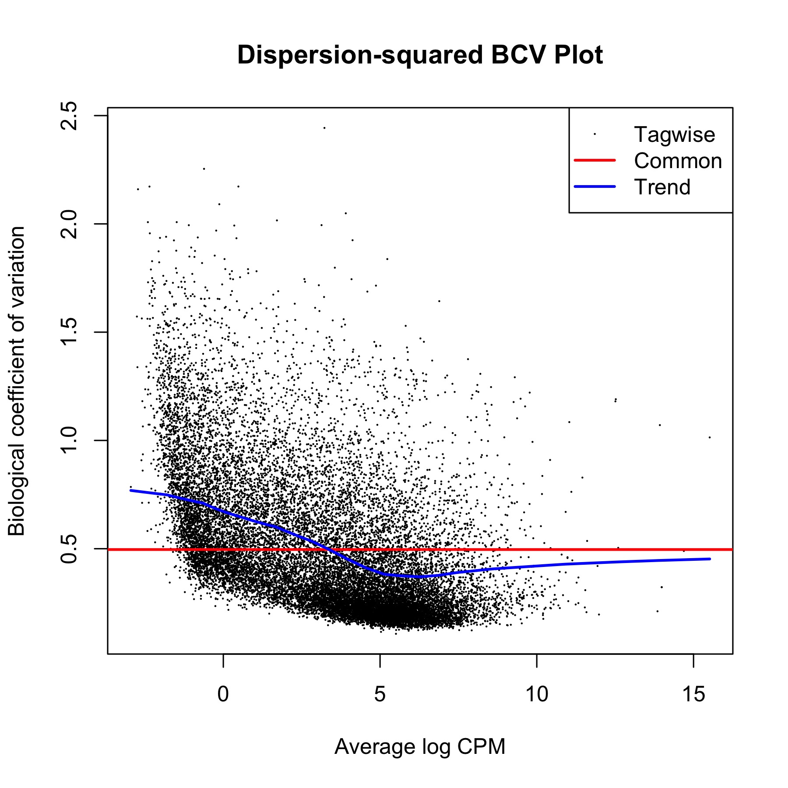
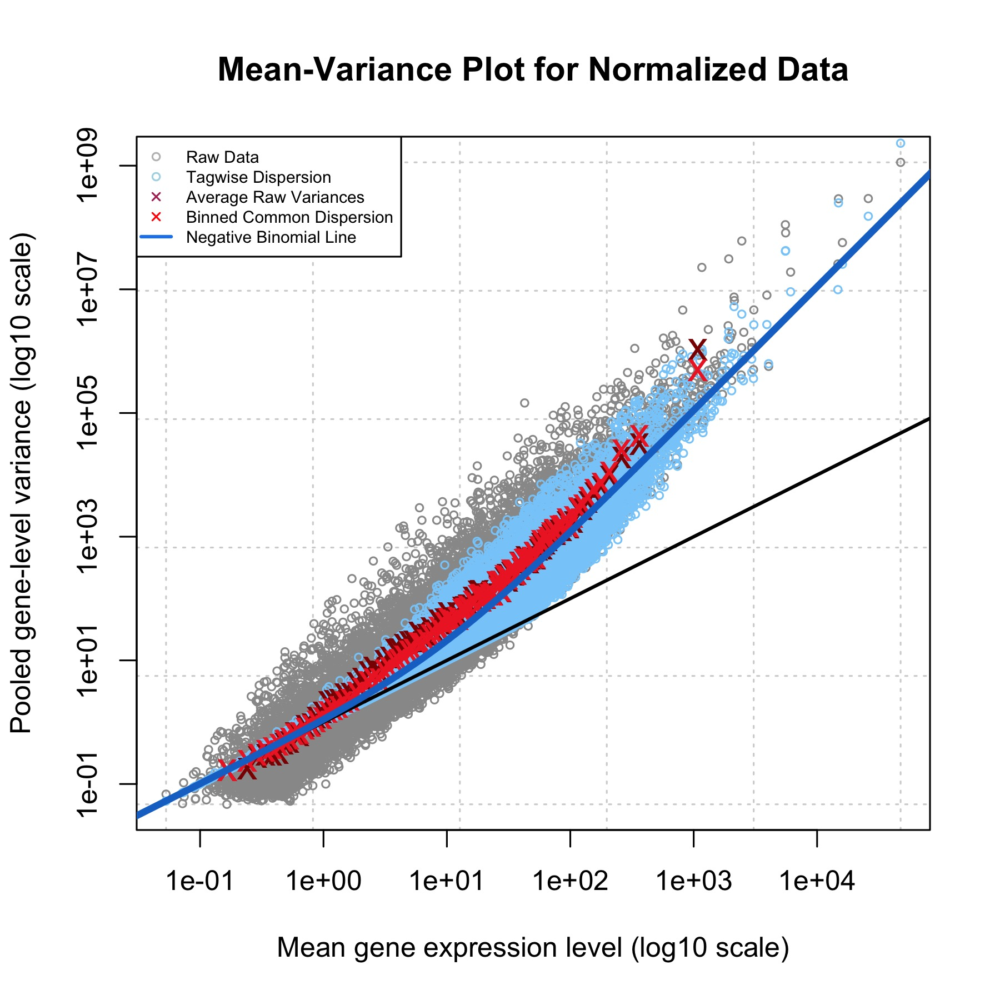
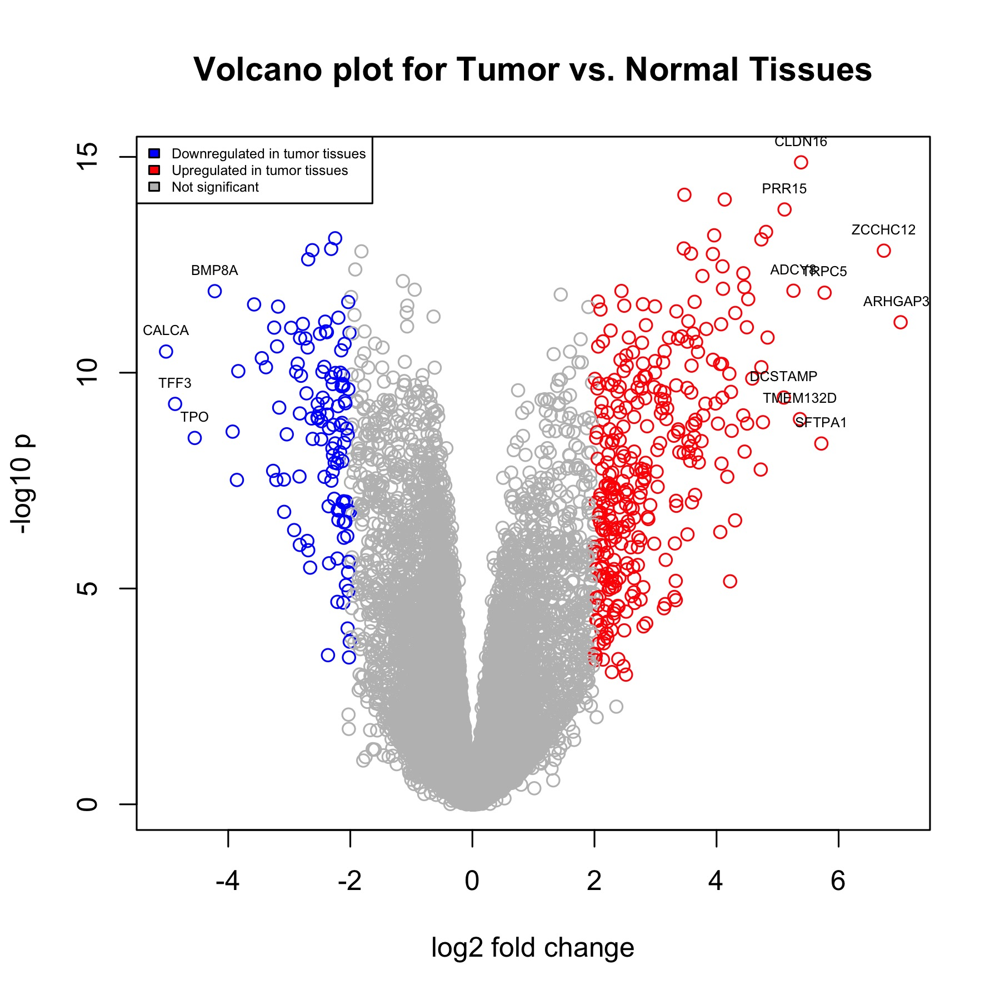
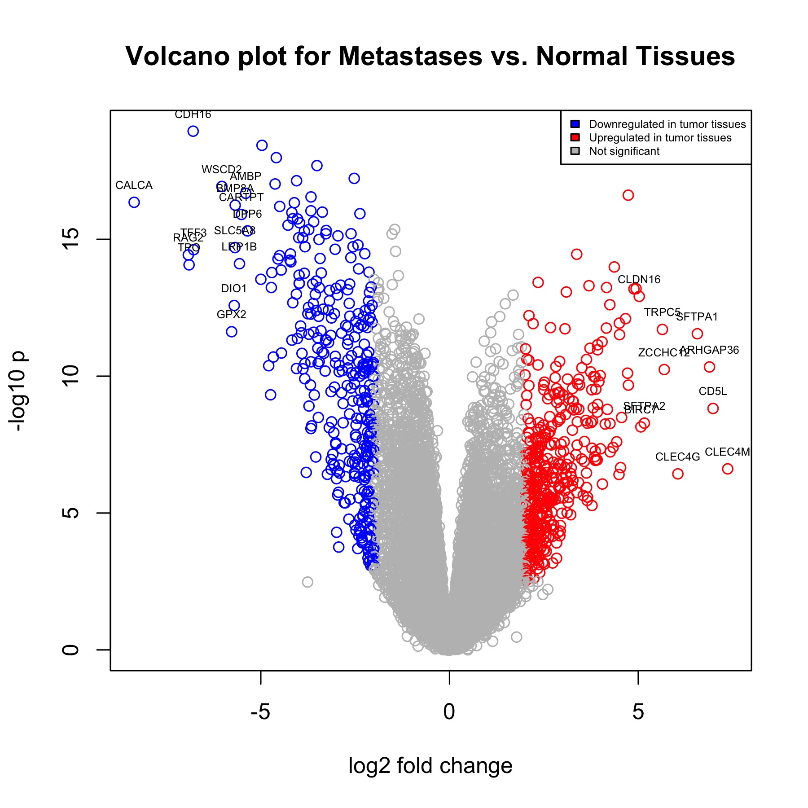
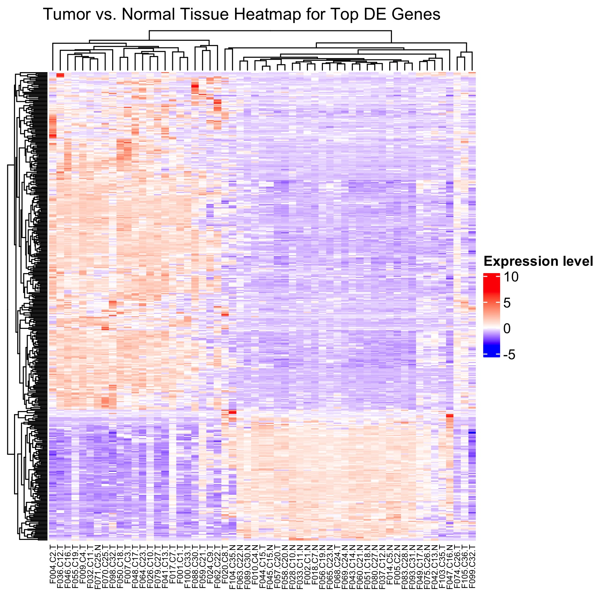
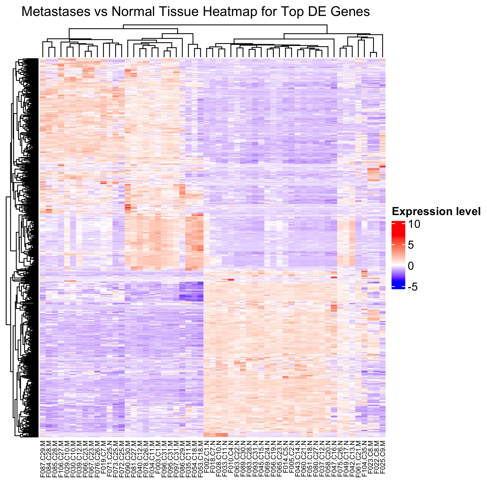

# Introduction

In the first assignment, we utilized the RNASeq data from Sanghi et al.'s publication "Chromatin Accessibility Associates with Protein-RNA Correlation in Human Cancer"(@sanghi2021a) to perform data cleaning, normalization, gene mapping to HUGO symbols, and preliminary analysis. The goal of the original study was to explore the relationship between chromatin structure alterations and molecular phenotypes in cancer by utilizing multi-omics profiling of human tumors. They applied this approach to a total of 36 individuals to obtain thyroid cancer primary tumors, metastases, and patient-matched normal tissue, with a total of 87 samples. The study identified a local chromatin structure that is highly correlated with coordinated RNA and protein expression, particularly within gene-body enhancers, and claimed that local enhancers may be more important for regulating cancer gene expression than distal enhancers. Moreover, the authors found that TFs in the MAPK pathway are actively bound significantly more in tumor and metastases than in normal tissue.

We obtained the dataset with the ID [GSE162515](https://www.ncbi.nlm.nih.gov/geo/query/acc.cgi?acc=GSE162515) from GEO, which is linked to the study "Chromatin Accessibility Associates with Protein-RNA Correlation in Human Cancer". The dataset contains a total of 28,883 genes, and the experiment conditions are categorized into 27 normal tissue samples, 30 tumor tissue samples, and 30 metastases tissue samples.

To improve the data quality, we removed genes with less than 1 count per million (cpm) in less than three samples, resulting in the removal of 11,538 genes. We then performed normalization using TMM with the edgeR package to correct the large deviation of means between the tumor, metastases and normal tissue groups while still preserving some of the original sample distribution. Interestingly, the data was already well-aligned after removing low counts, so the normalization step barely improved the quality of the dataset. Figures such as MDS plot and BCV plot are generated to visualize the quality, as shown below.

From the post-normalization MDS plot, we observed that the overall separation between each test condition group (T and M) and the normal group is clear, indicating a good dataset quality. 
```{r mds, out.width = "90%", echo = FALSE, fig.cap="Figure 1. MDS plot to inspect the sample separation. Green: metastases; Black: Tumor; Blue: Normal. The overall separation between each test condition group (T and M) to normal group is clear, indicating a good dataset quality."}

```

Additionally, the variance of the data was relatively consistent with the expected trend, as indicated by the dispersion-squared BCV plot.

```{r bcv, out.width = "90%", echo = FALSE, fig.cap="Figure 2. Dispersion-squared BCV plot. Genes with low counts have a higher variation, whereas genes with higher counts have a lower variation towards the expected trend. The trend of the count data falls around the common dispersion line in a BCV plot, indicating that the variance of the data is relatively consistent with the expected trend."}

```

To map identifiers, we utilized the package biomaRt. Fortunately, gene IDs in the original dataset were mostly already mapped to the corresponding HUGO gene symbols. After removing low counts, genes with duplicate identifiers, and genes that cannot be mapped to HUGO symbols, the final dataset contained 17,368 unique genes.


# Download Packages
In this section, we import and install the necessary packages for this assignment, in which we will conduct a differential expression analysis using the normalized dataset and a thresholded over-representation analysis.

* R (@r)
* [BiocManager](https://CRAN.R-project.org/package=BiocManager) (@morgan2021a)
* [GEOmetadb](https://bioconductor.org/packages/release/bioc/html/GEOmetadb.html) (@mccarthy2012a)
* [edgeR](https://bioconductor.org/packages/release/bioc/html/edgeR.html) (@robinson2010a, @mccarthy2012a, @chen2016a)
* [biomaRt](https://bioconductor.org/packages/release/bioc/html/biomaRt.html) (@durinck2009a, @durinck2005a)
* [GEOquery](https://bioconductor.org/packages/release/bioc/html/GEOquery.html) (@davis2007a)
* [Biobase & BioGenerics](https://bioconductor.org/packages/release/bioc/html/Biobase.html) (@huber2015a)
* [circlize](https://cran.r-project.org/web/packages/circlize/index.html) (@gu2014a)
* [ComplexHeatmap](https://bioconductor.org/packages/release/bioc/html/ComplexHeatmap.html) (@gu2016a)
* [gprofiler2](https://cran.r-project.org/web/packages/gprofiler2/index.html) (@kolberg2020a)

```{r Install packages, message=FALSE, warning=FALSE}
if (!requireNamespace("BiocManager", quietly = TRUE)){
  install.packages("BiocManager")}

if (!requireNamespace("GEOmetadb", quietly = TRUE)){
  BiocManager::install("GEOmetadb")}

if (!requireNamespace("circlize", quietly = TRUE))
    install.packages("circlize")

if (!requireNamespace("ComplexHeatmap", quietly = TRUE))
    BiocManager::install("ComplexHeatmap")

if (!requireNamespace("gprofiler2", quietly = TRUE))
    BiocManager::install("gprofiler2")

if (!requireNamespace("ggplot2", quietly = TRUE)){
  install.packages("ggplot2")}

if (!requireNamespace("edgeR", quietly = TRUE)){
  BiocManager::install("edgeR")}

if (!requireNamespace("biomaRt", quietly = TRUE)){
  BiocManager::install("biomaRt")}

if (!requireNamespace("knitr", quietly = TRUE)){
  install.packages("knitr")}

if (!requireNamespace("GEOquery", quietly = TRUE)){
  BiocManager::install("GEOquery")}

if (!requireNamespace("Biobase", quietly = TRUE)){
  BiocManager::install("Biobase")}

if (!requireNamespace("dplyr", quietly = TRUE)){
  install.packages("dplyr")}

if (!requireNamespace("kableExtra", quietly = TRUE)){
  install.packages("kableExtra")}

```

Load packages
```{r Load library, message=FALSE}
library("GEOmetadb")
library("ggplot2")
library("edgeR")
library("biomaRt")
library("ComplexHeatmap")
library("circlize")
library("dplyr")
library("GEOquery")
library("Biobase")
library("knitr")
library("kableExtra")
```

# Differential Expression Analysis

In this section, we will use edgeR package to perform differential expression analysis.

## Retrieve information from Assignment 1
The normalized data processed from Assignment 1 has been stored in the file named as "normalized_counts_final.txt". We now load this data into R.
The categories for the samples were saved in "samples.txt" file. We can also load it into R.
```{r retrieve_data, message=FALSE}
normalized_counts <- read.table("normalized_counts_final.txt")
samples <- read.table("samples.txt")
```

## Examine the normalized dataset
The format of the normalized count dataset has already been processed in a way that can be directly used to plot the heatmap, which would be our next step.
```{r check_data, message=FALSE}
kable(normalized_counts[1:5,1:5], format = "html")
```

## Examine the samples information

There are two columns, "individuals" and "tissue type". The "individual" column stores data of the patients who the authors took the samples from, and the "tissue type" indicates the type of the tissue, including tumors, metastases, and normal tissue.
```{r samples}
knitr::kable(head(samples, 10),  format = "html")
```

## Design Model
In this section, we will create a data matrix from our dataset.


In order to perform statistical testing, we need a design matrix that defines our model. Notice that in our dataset, there are two factors: 

1. Tissue types (Normal, tumor, metastases)
2. Patient (individual)

Hence, ideally, we would like to account for both factors in our design matrix.

Recall that we want to find the genes that are differentially expressed in the tumor and metastases samples in contrast to normal tissues, so we first factor the tissue types such that "N" type becomes the baseline/reference level. This would affect on which tissue type would be chosen as the control value (i.e. intercept) when performing __**model.matrix**__ function to generate the design matrix.
```{r design_matrix, message=FALSE}
# Set normal tissue type as the intercept
samples$tissue_type <- factor(samples$tissue_type)
samples$tissue_type <- relevel(samples$tissue_type, ref="N")

# Doesn't really matter for individual people, but we can set C1 as the intercept for the sake of habit.
samples$individual <- factor(samples$individual)
samples$individual <- relevel(samples$individual, ref="C1")

# Generate design matrix with both factors: individual and tissue type
model_design <- model.matrix(~ samples$individual + samples$tissue_type)

# Check the matrix
model_design[1:5,1:5]
```


## Analysis Using edgeR

For our downstream analysis, we are going to use edgeR, which is specifically designed for RNASeq data. First, we create the base edgeR object called DGEList. The group we want to define is the tissue type. 
```{r dispersion_calc, message=FALSE}
d <- edgeR::DGEList(counts = normalized_counts, group = samples$tissue_type)
```
For further processing, we choose to use the quasi-likelihood models since our dataset is from an RNASeq experiment and quasi-likelihood models are best suited to handle RNASeq data.

### Check Eligibility

One important underlying assumption for using the Quasi-likelihood model is that the data follows a negative binomial distribution. We need to verify that our dataset indeed meets that assumption.

To do this, we calculate the dispersion and generate the plot to visualize the mean-variance relationship. 

```{r estimate_disp, message = FALSE}
# Calculate dispersion
d <- edgeR::estimateDisp(d, model_design)
```

```{r mean_var_plot, eval = FALSE}
# Generate MV plot
edgeR::plotMeanVar(d,
                   show.raw.vars = TRUE,
                   show.tagwise.vars = TRUE,
                   NBline = TRUE,
                   show.ave.raw.vars = TRUE,
                   show.binned.common.disp.vars = TRUE,
                   main = "Mean-Variance Plot for Normalized Data")
# Display legend
legend("topleft", 
       legend=c("Raw Data", "Tagwise Dispersion", "Average Raw Variances", 
                "Binned Common Dispersion", "Negative Binomial Line"), 
       col = c("grey", "lightblue", "maroon", "red", "dodgerblue2"), pch=c(1,1,4,4,NA), lty=c(0,0,0,0,1), lwd=c(1,1,1,1,2), cex=0.6)
```

From the MV plot, we can see that our normalized count data follows the negative binomial distribution, where it clearly aligns with the blue line indicating the negative binomial trend.

```{r mean_var_display, out.width = "90%", echo = FALSE, fig.cap="Figure 3. Mean-variance plot showing the distribution of data. The dispersion and variance of the data perfectly follows the negative binomial distribution, in which the raw data and the blue negative binomial line alligns."}

```


<br>

Now, we have created the design matrix and verified the assumption for the data to be negative-binomially distributed, we can proceed to the next stage of our analysis. We fit the model using our design matrix: 

```{r fit_ql, message=FALSE}
fit <- edgeR::glmQLFit(d, model_design)
```
<br>

Once we have fit the model, we can proceed to calculate differential expression. We will perform the calculation separately for __**Tumor vs. Normal**__, and __**Metastases vs. Normal**__. To ensure that the significantly differentially expressed genes are not obtained by random, we will perform  correction for multiple hypothesis testing using Benjamini-Hochberg approach.

## Tumor vs. Normal

In this section, we want to test for differential expression between the tumor samples and normal samples.
```{r test_tn, message=FALSE}
# Conduct genewise statistical tests for tumor tissue as coefficient
qlf_tn <- edgeR::glmQLFTest(fit, coef='samples$tissue_typeT')

# Extract the top DE hits ranked by PValue
qlf_tn_hits <- edgeR::topTags(qlf_tn,sort.by = "PValue", adjust.method = "BH",
                           n = nrow(normalized_counts))

# Display table of top hits
knitr::kable(head(qlf_tn_hits$table), format = "html")
```
<br>

We can examine the number of genes pass the threshold and correction. We are using 0.05 as the threshold for p-value as it is commonly used in practice.
<br>

Number of genes that passed the threshold:
```{r pval_thresh, message=FALSE}
length(which(qlf_tn_hits$table$PValue < 0.05))
```
<br>
Number of genes that passed correction:
```{r fdr_thresh, message=FALSE}
length(which(qlf_tn_hits$table$FDR < 0.05))
```
<br>

The threshold of 0.05 gives us quite a lot of genes. However, since we are dealing with human disease, which should be more strict to obtain more meaningful hits for further analysis, we choose to use a more stringent threshold of 0.01.
<br>

Number of genes that passed the 0.01 p value threshold:
```{r tn_pval_stringent, message=FALSE}
length(which(qlf_tn_hits$table$PValue < 0.01))
```
<br>
Number of genes that passed correction of 0.01 threshold:
```{r tn_fdr_stringent, message=FALSE}
length(which(qlf_tn_hits$table$FDR < 0.01))
```
<br>
There are still a lot of genes left for further analysis. In later sections, genes that have differentially expressed for less than 2 log fold change (LFC) would also be filtered out to obtain a set of more meaningful data.


## Metastases vs. Normal

In this section, we test for differential expression between the metastasis tissues and the normal tissues.
```{r test_mn, message=FALSE}
# Conduct genewise statistical tests for metastases tissue as coefficient
qlf_mn <- edgeR::glmQLFTest(fit, coef='samples$tissue_typeM')

# Extract the top DE hits ranked by PValue
qlf_mn_hits <- edgeR::topTags(qlf_mn,sort.by = "PValue", adjust.method = "BH",
                           n = nrow(normalized_counts))

# Display table of top hits
knitr::kable(head(qlf_mn_hits$table), format = "html")

```

<br>
We apply the 0.01 threshold for the same reason as indicated previously.

Number of genes that passed the 0.01 p value threshold:
```{r mn_pval_stringent, message=FALSE}
length(which(qlf_mn_hits$table$PValue < 0.01))
```
<br>

Number of genes that passed correction with 0.01 threshold:
```{r mn_fdr_stringent, message=FALSE}
length(which(qlf_mn_hits$table$FDR < 0.01))
```
<br>

Again, we would also filter out the genes that have differentially expressed less than 2 LFC in later sections.

### Volcano Plot (Tumor vs. Normal)
We plot the volcano plot to visualize differential expression of genes for tumor vs. normal tissue samples. Each gene is represented by a point in the plot. The horizontal axis of the plot is the log2 fold change and the vertical axis is the -log10p which indicates how likely the differential of a gene is due to actual biological variation.
```{r volcano_plot_tn, eval = FALSE, message = FALSE}
# Make all data to grey first
volcano_color_tn = rep('gray', times = nrow(qlf_tn_hits$table))

# For those down-regulated genes with more than 2 LFC and passes 0.01 FDR 
# correction threshold, make it blue
volcano_color_tn[qlf_tn_hits$table$logFC < 0 &
                        qlf_tn_hits$table$FDR < 0.01
                      & abs(qlf_tn_hits$table$logFC) > 2] <- 'blue'

# For up-regulated genes with more than 2LFC and passes 0.01 FDR
# correction threshold, make it red
volcano_color_tn[qlf_tn_hits$table$logFC > 0 &
                        qlf_tn_hits$table$FDR < 0.01 &
                        abs(qlf_tn_hits$table$logFC) > 2] <- 'red'

# Plot the volcano plot
plot(qlf_tn_hits$table$logFC,
     -log(qlf_tn_hits$table$PValue, base=10),
     col = volcano_color_tn,
     xlab = "log2 fold change",
     ylab = "-log10 p",
     main = "Volcano plot for Tumor vs. Normal Tissues"
)

# Add the legend
legend("topleft", legend=c("Downregulated in tumor tissues","Upregulated in tumor tissues", "Not significant"),
       fill = c("blue", "red", "grey"), cex = 0.5)

# Label genes with over 4 LFC
tn_sig <- which(qlf_tn_hits$table$logFC > 5 | qlf_tn_hits$table$logFC < -4)
text(x = qlf_tn_hits$table$logFC[tn_sig] , y = -log10(qlf_tn_hits$table$PValue[tn_sig]),
     label = rownames(qlf_tn_hits$table)[tn_sig], cex = 0.5, adj = c(1, NA), pos = 3)

```

<br>
There is extensive number of upregulated genes in tumor tissues compared to normal tissues, with the highest of exceeding 6 LFC (log2 Fold Change). Several genes are significantly downregulated, having more than 4 LFC.
```{r tn_volcano_display, out.width = "90%", echo = FALSE, fig.cap="\\label{fig:volcano_tn}Figure 4. Volcano plot for the top differentially expressed genes that pass the 0.01 P-value threshold and has absolute LFC of larger than 2. Upregulated genes with absolute log fold change over 5 and downregulated genes with absolute LFC over 4 have been labeled out the corresponding HUGO symbols.", message=FALSE}

```
<br>


### Volcano Plot (Metastases vs. Normal)
We also plot the volcano plot to visualize differential expression of genes for metastases vs. normal tissue samples.
```{r volcano_plot_mn, eval = FALSE, message = FALSE}
# Make all data to grey first
volcano_color_mn = rep('gray', times = nrow(qlf_mn_hits$table))

# For those down-regulated genes with more than 2 LFC and passes 0.01 FDR 
# correction threshold, make it blue
volcano_color_mn[qlf_mn_hits$table$logFC < 0 &
                        qlf_mn_hits$table$FDR < 0.01
                      & abs(qlf_mn_hits$table$logFC) > 2] <- 'blue'

# For up-regulated genes with more than 2LFC and passes 0.01 FDR
# correction threshold, make it red
volcano_color_mn[qlf_mn_hits$table$logFC > 0 &
                        qlf_mn_hits$table$FDR < 0.01 &
                        abs(qlf_mn_hits$table$logFC) > 2] <- 'red'

# Plot the volcano plot
plot(qlf_mn_hits$table$logFC,
     -log(qlf_mn_hits$table$PValue, base=10),
     col = volcano_color_mn,
     xlab = "log2 fold change",
     ylab = "-log10 p",
     main = "Volcano plot for Metastases vs. Normal Tissues"
    )


# Add the legend
legend("topright", legend=c("Downregulated in tumor tissues","Upregulated in tumor tissues", "Not significant"),fill = c("blue", "red", "grey"), cex = 0.5)

# Label genes with over 5 LFC
mn_sig <- which(qlf_mn_hits$table$logFC > 5 | qlf_mn_hits$table$logFC < -5)
text(x = qlf_mn_hits$table$logFC[mn_sig] , y = -log10(qlf_mn_hits$table$PValue[mn_sig]), label = rownames(qlf_mn_hits$table)[mn_sig], cex = 0.5, adj = c(1, NA), pos = 3)

```

<br>

There is extensive number of upregulated and downregulated genes in metastases tissues compared to normal tissues, with the highest of exceeding 5 LFC.
```{r mn_volcano_display, out.width = "90%", echo=FALSE, fig.cap="\\label{fig:volcano_mn}Figure 5. Volcano plot for the top differentially expressed genes that pass the 0.01 P-value threshold and has absolute LFC of larger than 2. Genes with absolute log fold change over 5 have been labeled out the corresponding HUGO symbols."}

```
<br>


### Heatmap (Tumor vs. Normal)
In order to find the most significantly differentially expressed, we pick the hits that pass a P-value threshold of 0.01, and has absolute value of LFC larger than 2 as the top hits.
```{r tn_top_DE, message=FALSE}
# Get top hit genes for T vs N
top_hits_tn <- rownames(qlf_tn_hits)[qlf_tn_hits$table$PValue < 0.01 & abs(qlf_tn_hits$table$logFC) > 2]
```

Then, we calculate their log2 counts per million value. We add 1 to the value to eliminate mathematical error when the count is 0. This technique is commonly used in practise when calculating log values.

```{r logCPM, message=FALSE}
# Calculate logCPM
hm_matrix <- log2(normalized_counts + 1) # Plus 1 to eliminate error when the count is 0.
```

Obtain data for each category
```{r}
# Obtain tumor and normal tissue samples
tumor <- grep("T$", colnames(hm_matrix), value=TRUE)
normal <- grep("N$", colnames(hm_matrix), value=TRUE)
metastases <- grep("M$", colnames(hm_matrix), value=TRUE)
```

Scale heat map matrix by rows.
```{r tn_scale, message=FALSE}
# Scale heat map matrix by rows
hm_matrix_tn <- t(scale(t(hm_matrix[rownames(hm_matrix) %in% top_hits_tn, c(tumor, normal)])))
```

Pick the color to be used for the plot. If heatmap only contains non-negative values, we will use only white and red, where white indicates 0, and red indicates positive values.

Otherwise, we will use blue to represent negative values.

We plot the heatmap to visualize differential expression of genes for metastases vs. normal tissue samples.
```{r tn_heatmap, eval=FALSE, message = FALSE}
# Choose colors to be used
if(min(hm_matrix_tn) == 0){
    heatmap_color = colorRamp2(c( 0, max(hm_matrix_tn)),
                             c( "white", "red"))
  } else {
    heatmap_color = colorRamp2(c(min(hm_matrix_tn), 0,
          max(hm_matrix_tn)), c("blue", "white", "red"))
  }

# Create the heatmap from the given matrix, showing the dendrogram for both genes and samples.
name = "Expression level"
hm_tn <- Heatmap(as.matrix(hm_matrix_tn),
      show_row_dend = TRUE, show_column_dend = TRUE,
      col = heatmap_color, show_column_names = TRUE,
      show_row_names = FALSE, show_heatmap_legend = TRUE,
      column_names_gp = grid::gpar(fontsize = 6),
      heatmap_legend_param = list(title = name))

draw(hm_tn,
   column_title="Tumor vs. Normal Tissue Heatmap for Top DE Genes",
   column_title_gp=grid::gpar(fontsize=12))


```

```{r tn_heatmap_display, out.width = "90%", echo = FALSE, fig.width=7,fig.height=6,fig.cap="\\label{fig:heatmap_tn}Figure 6. Heatmap for the top differentially expressed genes that pass the 0.01 P-value threshold. There are clear clusterings of genes that are upregulated in tumor tissues, while are downregulated in normal tissues, indicating confident evidence of differentially expressed genes.", message = FALSE}

```


### Heatmap (Metastases vs. Normal)
Now we can also plot heatmap for Metastases vs. Normal comparison, with same steps as above.
```{r mn_top_DE, message=FALSE}
# Get top hit genes for M vs N
top_hits_mn <- rownames(qlf_mn_hits)[qlf_mn_hits$table$PValue < 0.01 & abs(qlf_mn_hits$table$logFC) > 2]
```

```{r mn_scale, message=FALSE}
# Scale heat map matrix by rows
hm_matrix_mn <- t(scale(t(hm_matrix[rownames(hm_matrix) %in% top_hits_mn, c(metastases, normal)])))
```

```{r mn_heatmap, eval = FALSE}
# Choose colors to be used
if(min(hm_matrix_mn) == 0){
    heatmap_color = colorRamp2(c( 0, max(hm_matrix_mn)),
                             c( "white", "red"))
  } else {
    heatmap_color = colorRamp2(c(min(hm_matrix_mn), 0,
          max(hm_matrix_mn)), c("blue", "white", "red"))
  }

# Create the heatmap from the given matrix, showing the dendrogram for both genes and samples.
hm_mn <- Heatmap(as.matrix(hm_matrix_mn),
      show_row_dend = TRUE, show_column_dend = TRUE,
      col = heatmap_color, show_column_names = TRUE,
      show_row_names = FALSE, show_heatmap_legend = TRUE,
      column_names_gp = grid::gpar(fontsize = 6),
      heatmap_legend_param = list(title = name))

draw(hm_mn,
   column_title="Metastases vs Normal Tissue Heatmap for Top DE Genes",
   column_title_gp=grid::gpar(fontsize=12))
```

```{r mn_heatmap_display, out.width = "90%", echo = FALSE, message = FALSE, fig.width=7,fig.height=6,fig.cap="\\label{fig:heatmap_mn}Figure 7. Heatmap for the top differentially expressed genes that pass the 0.01 P-value threshold. There are clear clusterings of genes that are upregulated in metastases tissues, while are downregulated in normal tissues, indicating confident evidence of differentially expressed genes."}

```


## Differential Expression Analysis Discussion

### 1. Calculate p-values for each of the genes in your expression set. How many genes were significantly differentially expressed? What thresholds did you use and why?

At first, I employed the commonly used p-value of 0.05, resulting in 7145 genes for the tumor vs. normal tissue analysis, and 8634 genes for the metastases vs. normal tissue analysis, before multiple hypothesis testing corrections. However, this was an extensive set of genes, prompting us to alter the p-value threshold to 0.01, and FDR threshold also to 0.01, to restrict the number of genes to be included. Additionally, we imposed a criterion that a gene should have an absolute log2 fold change of at least 2. This ensured that we only obtained genes with significant differential expression, which we believed to be meaningful and essential for further analysis.

### 2. Multiple hypothesis testing - correct your p-values using a multiple hypothesis correction method. Which method did you use? And Why? How many genes passed correction?

The two primary approaches for controlling false discovery rate are Bonferroni and Benjamini-Hochberg corrections, and we employed the Benjamini-Hochberg method for multiple hypothesis testing correction. Our objective was to identify significant hits without omitting meaningful ones. Bonferroni method is useful when the number of tests is small and when the tests are independent of each other, but it becomes overly stringent and impractical when the number of tests is large or when the tests are correlated. Since we are dealing with a large dataset with over 80 samples, Bonferroni is not desirable for our purpose. Therefore, we opted for Benjamini-Hochberg correction, which provided a more comprehensive set of genes for downstream analysis. Following this correction, we found that the tumor vs. normal tissue analysis yielded 3893 genes, and the metastases vs. normal tissue analysis yielded 5477 genes that passed the correction.

### 3. Show the amount of differentially expressed genes using an MA Plot or a Volcano plot. Highlight genes of interest.

Volcano plots for both Tumor vs. Normal and Metastases vs. Normal datasets are shown above. The most significantly differentially expressed genes are labeled out by their HUGO symbols in the figures.

### 4. Visualize your top hits using a heatmap. Do your conditions cluster together? Explain why or why not.

There are clear clusterings within conditions, as shown in the graph represented in red and blue. This suggests that the tumor tissues and metastases tissues do have genes that are highly differentially expressed compared to normal tissues. 


# Thresholded Overrepresentation Analysis using g:Profiler


For the final part of this assignment, we will perform a thresholded overrepresentation analysis using g:Profiler. In the previous section, we have compiled a list of differentially expressed genes. Here, we want to further divide them into upregulated and downregulated genes.

## Tumor vs. Normal Tissue
First, we obtain the upregulated and downregulated genes from the tumor vs. normal tissue dataset.
```{r tn_split_updownregulated}
upregulated_tn <- qlf_tn_hits[qlf_tn_hits$table$logFC > 0 & qlf_tn_hits$table$PValue < 0.01, ]
downregulated_tn <- qlf_tn_hits[qlf_tn_hits$table$logFC < 0 & qlf_tn_hits$table$PValue < 0.01, ]
```

We use the R package for g:Profiler to perform the gene enrichment analysis. For correction, we used FDR as it is less stringent than Bonferroni and is introduced to be the preferred correction method in class. We used GO Biological Process, GO Molecular Function, and WP as those are the ones used previously in Journal entry assignments, which we are more familiar with.

Then, we perform analysis separately for up-regulated genes and down-regulated genes.

### Upregulated Genes
To obtain the terms these genes are involved in, we use the __**gost**__ function from gProfiler2 package.
```{r tn_gprofiler_up, message=FALSE}
# Obtain top terms
tn_up_top_terms_all <- gprofiler2::gost(query = rownames(upregulated_tn), 
                                  organism = "hsapiens", 
                                  exclude_iea = TRUE,
                                  correction_method = "fdr",
                                  sources = c("GO:BP", "REAC", "WP"))
# Limit term size from 1 to 500
tn_up_top_terms <- data.frame(
  term_name = tn_up_top_terms_all$result$term_name[tn_up_top_terms_all$result$term_size < 500 &
                                               tn_up_top_terms_all$result$term_size > 1],
  term_id = tn_up_top_terms_all$result$term_id[tn_up_top_terms_all$result$term_size < 500 &
                                           tn_up_top_terms_all$result$term_size > 1],
  source = tn_up_top_terms_all$result$source[tn_up_top_terms_all$result$term_size < 500 &
                                         tn_up_top_terms_all$result$term_size > 1]
)

knitr::kable(head(tn_up_top_terms, 10), format = "html")
```

For context, let's examine the top term from each data source.

```{r tn_up_top_term_per_category, message=FALSE}
knitr::kable(rbind(tn_up_top_terms[tn_up_top_terms$source == "GO:BP",][1,],
                   tn_up_top_terms[tn_up_top_terms$source == "REAC",][1,],
                   tn_up_top_terms[tn_up_top_terms$source == "WP",][1,]),
             format = "html")
```
Generate a Manhattan plot to visualize the distribution of the top terms from each data source.

```{r tn_up_dist_plot, fig.cap="Figure 8. Manhattan plot displaying the distribution of the top terms from each data source for upregulated genes in tumor vs. normal comparison. There are extensive numbers of GP:BP terms copared to REAC and WP, and terms such as cell adhesion, anatomical structure morphogenesis and anatomical structure development are exceeding 16 -log10 correction threshold."}
gprofiler2::gostplot(tn_up_top_terms_all) %>% plotly::layout(title = "Manhattan plot for Upregulated genes (Tumor vs. Normal)", font = list(size = 10))
```
Number of terms:
```{r tn_count_up_top_terms, message=FALSE}
length(tn_up_top_terms$term_name)
```

### Downregulated Genes

We do the same for the downregualted genes.

```{r tn_gprofiler_down, message=FALSE}
tn_down_top_terms_all <- gprofiler2::gost(query = rownames(downregulated_tn), 
                                  organism = "hsapiens", 
                                  exclude_iea = TRUE,
                                  correction_method = "fdr",
                                  sources = c("GO:BP", "REAC", "WP"))

tn_down_top_terms <- data.frame(
  term_name = tn_down_top_terms_all$result$term_name[tn_down_top_terms_all$result$term_size < 500 &
                                                 tn_down_top_terms_all$result$term_size > 1],
  term_id = tn_down_top_terms_all$result$term_id[tn_down_top_terms_all$result$term_size < 500 &
                                             tn_down_top_terms_all$result$term_size > 1],
  source = tn_down_top_terms_all$result$source[tn_down_top_terms_all$result$term_size < 500 &
                                           tn_down_top_terms_all$result$term_size > 1]
)

knitr::kable(head(tn_down_top_terms, 10),format = "html")
```
<br>
Top terms from the data sources:
```{r tn_down_top_term_per_category, message=FALSE}
knitr::kable(rbind(tn_down_top_terms[tn_down_top_terms$source == "GO:BP",][1,],
                   tn_down_top_terms[tn_down_top_terms$source == "REAC",][1,],
                   tn_down_top_terms[tn_down_top_terms$source == "WP",][1,]),
             format = "html")
```
Plot the Manhattan plot to visualize distribution of terms from each data source for downregulated genes.

```{r tn_down_dist_plot, fig.cap="Figure 9. Manhattan plot displaying the distribution of the top terms from each data source for downregulated genes in tumor vs. normal comparison. There are less terms included comparing to the upregulated genes."}
gprofiler2::gostplot(tn_down_top_terms_all) %>% 
  plotly::layout(title = "Manhattan plot for Downregulated genes (Tumor vs. Normal)", font = list(size = 10))
```
Number of terms
```{r tn_count_down_top_terms, message=FALSE}
length(tn_down_top_terms$term_name)
```

### All Differentially Expressed Genes

Finally, we analyze for all differentially expressed genes (i.e. both up-regulated and down-regulated genes as a whole).

```{r tn_gprofiler_overall, message=FALSE}
tn_top_terms_all <- gprofiler2::gost(query = rownames(qlf_tn_hits), 
                                  organism = "hsapiens", 
                                  exclude_iea = TRUE,
                                  correction_method = "fdr",
                                  sources = c("GO:BP", "REAC", "WP"))

tn_top_terms <- data.frame(
  term_name = tn_top_terms_all$result$term_name[tn_top_terms_all$result$term_size < 500 &
                                            tn_top_terms_all$result$term_size > 1],
  term_id = tn_top_terms_all$result$term_id[tn_top_terms_all$result$term_size < 500 &
                                        tn_top_terms_all$result$term_size > 1],
  source = tn_top_terms_all$result$source[tn_top_terms_all$result$term_size < 500 &
                                      tn_top_terms_all$result$term_size > 1]
)

knitr::kable(head(tn_top_terms, 10), format = "html")
```
<br>
Top terms from the data sources:

```{r tn_top_term_per_category, message=FALSE}
knitr::kable(rbind(tn_top_terms[tn_top_terms$source == "GO:BP",][1,],
                   tn_top_terms[tn_top_terms$source == "REAC",][1,],
                   tn_top_terms[tn_top_terms$source == "WP",][1,]),
             format = "html")
```


```{r tn_all_dist_plot, fig.cap="Figure 10. Manhattan plot displaying the distribution of the top terms from each data source for all genes in tumor vs. normal comparison. There are many terms exceeding 16 adjusted p vallue, indicating very strong enrichment signal."}
gprofiler2::gostplot(tn_top_terms_all) %>% plotly::layout(title = "Manhattan plot for All DE genes (Tumor vs. Normal)", font = list(size = 10))
```

There a total of 1447 terms:
```{r tn_count_top_terms, message=FALSE}
length(tn_top_terms$term_name)
```


## Metastases vs. Normal Tissue

Again, we perform the analysis for Metastases vs. Normal tissue comparison. First, we obtain the up-regulated genes and down-regulated genes separately.
```{r mn_split_updownregulated}
upregulated_mn <- qlf_mn_hits[qlf_mn_hits$table$logFC > 0 & qlf_mn_hits$table$PValue < 0.01, ]
downregulated_mn <- qlf_mn_hits[qlf_mn_hits$table$logFC < 0 & qlf_mn_hits$table$PValue < 0.01, ]
```

### Upregulated Genes
Obtain all terms involved for up-regulated genes using GO:BP, REAC and WP data source.
```{r mn_gprofiler_up, message=FALSE}
mn_up_top_terms_all <- gprofiler2::gost(query = rownames(upregulated_mn), 
                                  organism = "hsapiens", 
                                  exclude_iea = TRUE,
                                  correction_method = "fdr",
                                  sources = c("GO:BP", "REAC", "WP"))

mn_up_top_terms <- data.frame(
  term_name = mn_up_top_terms_all$result$term_name[mn_up_top_terms_all$result$term_size < 500 &
                                               mn_up_top_terms_all$result$term_size > 1],
  term_id = mn_up_top_terms_all$result$term_id[mn_up_top_terms_all$result$term_size < 500 &
                                           mn_up_top_terms_all$result$term_size > 1],
  source = mn_up_top_terms_all$result$source[mn_up_top_terms_all$result$term_size < 500 &
                                         mn_up_top_terms_all$result$term_size > 1]
)

knitr::kable(head(mn_up_top_terms, 10), format = "html")
```
For context, let's examine the top term from each data source.

```{r mn_up_top_term_per_category, message=FALSE}
knitr::kable(rbind(mn_up_top_terms[mn_up_top_terms$source == "GO:BP",][1,],
                   mn_up_top_terms[mn_up_top_terms$source == "REAC",][1,],
                   mn_up_top_terms[mn_up_top_terms$source == "WP",][1,]),
             format = "html")
```
We can visualize the distribution of top terms from each data source using an Manhattan plot.

```{r mn_up_dist_plot, fig.cap="Figure 11. Manhattan plot displaying the distribution of the top terms from each data source for up-regulated genes in metastases vs. normal comparison. There are many terms exceeding 16 adjusted p vallue, indicating very strong enrichment signal."}
gprofiler2::gostplot(mn_up_top_terms_all) %>% plotly::layout(title = "Manhattan plot for upregulated genes (Metastases vs. Normal)", font = list(size = 10))
```

Number of terms:
```{r mn_count_up_top_terms, message=FALSE}
length(mn_up_top_terms$term_name)
```

### Downregulated Genes

We do the same for the downregualted genes.

```{r mn_gprofiler_down, message=FALSE}
mn_down_top_terms_all <- gprofiler2::gost(query = rownames(downregulated_mn), 
                                  organism = "hsapiens", 
                                  exclude_iea = TRUE,
                                  correction_method = "fdr",
                                  sources = c("GO:BP", "REAC", "WP"))

mn_down_top_terms <- data.frame(
  term_name = mn_down_top_terms_all$result$term_name[mn_down_top_terms_all$result$term_size < 500 &
                                                 mn_down_top_terms_all$result$term_size > 1],
  term_id = mn_down_top_terms_all$result$term_id[mn_down_top_terms_all$result$term_size < 500 &
                                             mn_down_top_terms_all$result$term_size > 1],
  source = mn_down_top_terms_all$result$source[mn_down_top_terms_all$result$term_size < 500 &
                                           mn_down_top_terms_all$result$term_size > 1]
)

knitr::kable(head(mn_down_top_terms, 10), format = "html")
```

```{r mn_down_top_term_per_category, message=FALSE}
knitr::kable(rbind(mn_down_top_terms[mn_down_top_terms$source == "GO:BP",][1,],
                   mn_down_top_terms[mn_down_top_terms$source == "REAC",][1,],
                   mn_down_top_terms[mn_down_top_terms$source == "WP",][1,]),
             format = "html")
```
Plot the Manhattan plot showing distribution of terms from each data source using list of downregulated genes.

```{r mn_down_dist_plot, fig.cap="Figure 12. Manhattan plot displaying the distribution of the top terms from each data source for down-regulated genes in metastases vs. normal comparison. There are less terms involved for down-regulated genes compared to the up-regulated genes."}
gprofiler2::gostplot(mn_down_top_terms_all) %>% 
  plotly::layout(title = "Manhattan plot for downregulated genes (Metastases vs. Normal)", font = list(size = 10))
```

Number of terms returned:
```{r mn_count_down_top_terms, message=FALSE}
length(mn_down_top_terms$term_name)
```

### All Differentially Expressed Genes

Finally, for all differentially expressed genes.

```{r mn_gprofiler_overall, message=FALSE}
mn_top_terms_all <- gprofiler2::gost(query = rownames(downregulated_mn), 
                                  organism = "hsapiens", 
                                  exclude_iea = TRUE,
                                  correction_method = "fdr",
                                  sources = c("GO:BP", "REAC", "WP"))

mn_top_terms <- data.frame(
  term_name = mn_top_terms_all$result$term_name[mn_top_terms_all$result$term_size < 500 &
                                            mn_top_terms_all$result$term_size > 1],
  term_id = mn_top_terms_all$result$term_id[mn_top_terms_all$result$term_size < 500 &
                                        mn_top_terms_all$result$term_size > 1],
  source = mn_top_terms_all$result$source[mn_top_terms_all$result$term_size < 500 &
                                      mn_top_terms_all$result$term_size > 1]
)

knitr::kable(head(mn_top_terms, 10), format = "html")
```

Top terms from each data source for all differentially expressed genes (Metastases vs. Normal)
```{r mn_top_term_per_category, message=FALSE}
knitr::kable(rbind(mn_top_terms[mn_top_terms$source == "GO:BP",][1,],
                   mn_top_terms[mn_top_terms$source == "REAC",][1,],
                   mn_top_terms[mn_top_terms$source == "WP",][1,]),
             format = "html")
```

And again, we plot the Manhattan plot to visualize the terms enrichment:
```{r mn_all_dist_plot, fig.cap="Figure 12. Manhattan plot displaying the distribution of the top terms from each data source for all genes in metastases vs. normal tissue comparison. There are less terms involved for this comparison, comparing to the tumor vs. normal group."}
gprofiler2::gostplot(mn_top_terms_all) %>% 
  plotly::layout(title = "Manhattan plot for All DE genes 
                 (Metastases vs. Normal)", font = list(size = 10))
```

Number of terms:
```{r mn_count_top_terms, message=FALSE}
length(mn_top_terms$term_name)
```


## Thresholded Over-representation analysis Discussion

### 1. Which method did you choose and why?

I chose g:Profiler because it was discussed in lectures, and previous Journal Entry assignment has introduced the g:Profiler to us with its usage. It provides several analysis methods and visualizations for genomic data, which meets our need. Moreover, I had previous experience using its web-interface, and after learning that it also has R package utility, this is a good chance to try it out. 

### 2. What annotation data did you use and why? What version of the annotation are you using?
I choose GO:BP, Reactome, and WikiPathways for annotation because they were previously mentioned in the Journal Assignment, which were also used on human genes, and these three are very comprehensive datasets for human pathways. The version I am using is as follows:
- GO:BP releases/2022-12-04
- REAC releases/2022-12-28
- WP releases/20221210

### 3. How many genesets were returned with what thresholds?

For all three analysis (using upregulated, downregulated, all differentially expressed) for both tumor vs. normal tissue and metastases vs. normal tissue, we used a threshold of adjusted p value of 0.01, and limit term size between 1 and 500. We set the upper bound to 500 because we do not want to include overly broad and generic terms that will not give us meaningful insights into the roles of the differentially expressed genes. The P value threshold is set to 0.01.

Tumor vs. Normal: <br>
Upregulated genes returned 490 gene sets; 
Downregulated genes returned 154 genes ets; 
All differentially expressed genes returned 1151 gene sets.

Metastases vs. Normal: <br>
Upregulated genes returned 1180 gene sets; 
Downregulated genes returned 162 gene sets; 
All differentially expressed genes returned 162 gene sets.

### 4. Run the analysis using the up-regulated set of genes, and the down-regulated set of genes separately. How do these results compare to using the whole list (i.e all differentially expressed genes together vs. the up-regulated and down regulated differentially expressed genes separately)?

Tumor vs. Normal: <br>
Taking all DE genes together returned more gene sets than the results for upregulated and downregulated separately, and the results for upregulated genes are about three times more than the downregulated genes. This suggests that the upregulated genes may be more strongly associated with specific biological processes or pathways than the downregulated genes. Similarly, the fact that the combined set of DE genes returned more gene sets than either the upregulated or downregulated genes alone suggests that there may be some shared biological processes or pathways that are affected by both upregulated and downregulated genes.

Metastases vs. Normal: <br>
Upregulated genes returned around 10 times more terms than the result for all DE genes as a whole. This indicates that the upregulated genes are enriched for certain biological functions or pathways more strongly than the overall set of differentially expressed genes.


# Interpretation

### 1. Do the over-representation results support conclusions or mechanism discussed in the original paper?
Not too much, the over-representation results doesn't strongly support the conclusions and mechanism discussed in the original paper, probably due to the annotation sources that I choose that yelds different results. However, terms such as regulation of mitotic cell cycle showed up within the analysis result for up-regulated gene sets for tumor tissues and metastases tissues. In the original paper, the authors predicted that the tumors would have TFs that interact with the MAPK pathway and regulate gene expression in a way that is relevant to the development and progression of cancer, and indeed they found that TFs in the MAPK pathway are actively bound significantly more in tumor and metastases than in normal tissue. Transcription factors are widely know to play a role in regulating gene expresison, which would also affect mitotic cell cycle, indicating that our results support the conclusions discussed in the original paper in some way.

### 2. Can you find evidence, i.e. publications, to support some of the results that you see. How does this evidence support your results. 

There are publications describing how transcription factors regulates mitotic cell cycle. In the review paper "Coordinating gene expression during the cell cycle" by Martin.F et. al, they discussed the control mechanisms for mitotic cell cycles in mammals, which include activating genes with peak expression in G1/S by E2F transcription factors (TFs), which is required for DNA synthesis. (@FISCHER20221009). 


# References


