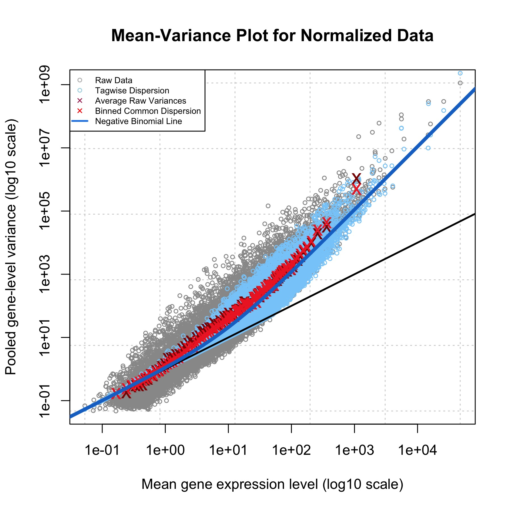
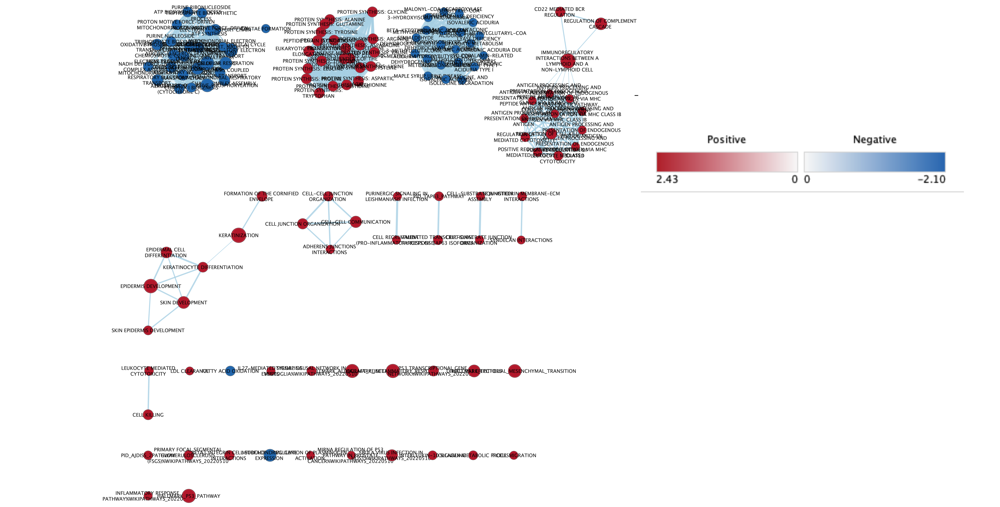
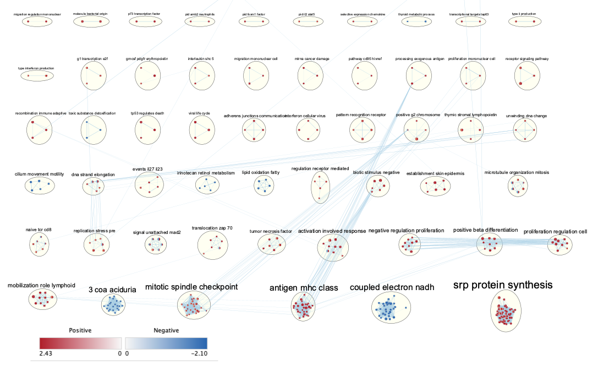
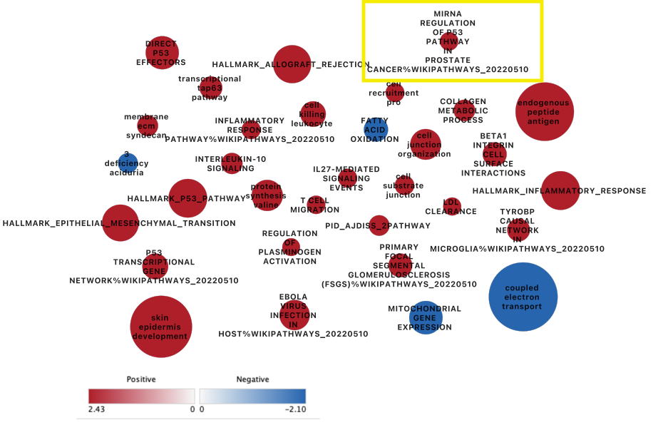
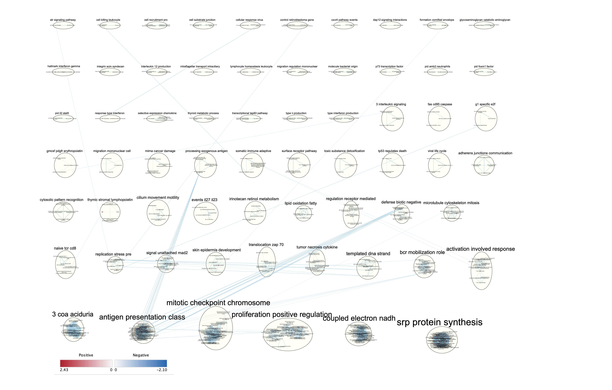
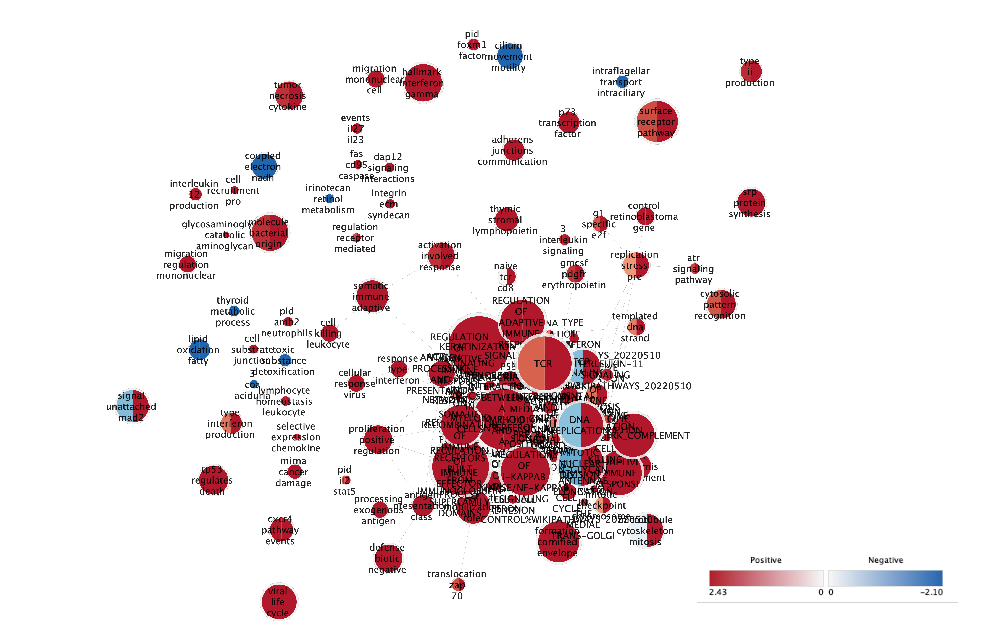
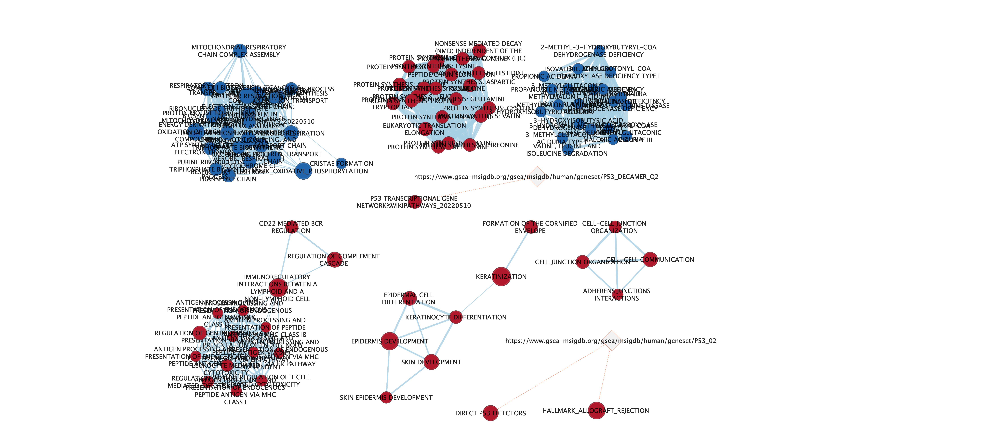

# Introduction

In Assignment 1, we utilized RNASeq data from Sanghi et al.'s publication "Chromatin Accessibility Associates with Protein-RNA Correlation in Human Cancer". The authors aimed to explore the relationship between chromatin structure and molecular phenotypes in cancer by analyzing multi-omics profiles of 87 human thyroid cancer primary tumors, metastases, and patient-matext_connectionhed normal tissue samples. Specifically, they identified a local chromatin structure that showed strong correlation with coordinated RNA and protein expression, particularly within gene-body enhancers, and claimed that local enhancers may be more important for regulating cancer gene expression than distal enhancers. Moreover, the authors found that TFs in the MAPK pathway are actively bound significantly more in tumor and metastases than in normal tissue. 

We retrieved the dataset (ID GSE162515) from GEO and filtered out low counts, where we removed genes that had less than 1 count per million (cpm) in less than three samples, resulting in the exclusion of 11538 genes. Normalizing the data by TMM with the edgeR package only slightly improved the dataset's quality since the data was already well-aligned after filtering low counts. We then used the biomaRt package with Ensembl data to map Ensembl gene IDs to HUGO gene symbols, resulting in a final dataset of 17368 unique genes after removing low counts, genes with duplicate identifiers, and genes that could not be mapped to HUGO symbols.

In Assignment 2, we analyzed the normalized count data generated from Assignment 1 by performing differential expression analysis and thresholded over-representation analysis separately for the "Tumor tissue vs. Normal tissue" and the "metastases tissue vs. Normal tissue" groups. The thresholds applied on the dataset were p value of 0.01, FDR of 0.05, and log2 fold change of 2. The results showed that upregulated genes may be more strongly associated with specific biological processes or pathways, such as regulation of mitotic cell cycle, than downregulated genes, and that there may be some shared biological processes or pathways affected by both upregulated and downregulated genes. We also found that upregulated genes are enriched for some biological functions or pathways more strongly than the overall set of differentially expressed genes in the "Met vs. Normal" group. However, the subsequent over-representation results did not strongly support the conclusions and mechanism discussed in the original paper probably due to different annotation sources used. In the original paper, the authors predicted that the tumors would have TFs that interact with the MAPK pathway and regulate gene expression in a way that is relevant to the development and progression of cancer, and indeed they found that TFs in the MAPK pathway are actively bound significantly more in tumor and metastases than in normal tissue. Transcription factors are widely know to play a role in regulating gene expresison, which would also affect mitotic cell cycle, indicating that our results support the conclusions discussed in the original paper in some way.

In this assignment, we will further investigate on our dataset and try to gain more insights into the pathways that significant genes are involved in to better understand the mechanism for human tumor. We will use non-thresholded gene enrichment analysis to obtain a more diverse portfolio of differentially expressed genes and compare the results with those from the previously performed thresholded analysis. We hope that the non-thresholded analysis results will strengthen the plausibility of our previous results and the authors’ hypothesis in the original publication. We will use the results obtained from the non-thresholded analysis to create an enrichment map network and conduct further analysis using the network.


# Download Packages
In this section, we import and install the necessary packages for this assignment, in which we will conduct a differential expression analysis using the normalized dataset and a thresholded over-representation analysis.

* R (@r)
* [BiocManager](https://CRAN.R-project.org/package=BiocManager) (@morgan2021a)
* [GEOmetadb](https://bioconductor.org/packages/release/bioc/html/GEOmetadb.html) (@mccarthy2012a)
* [edgeR](https://bioconductor.org/packages/release/bioc/html/edgeR.html) (@robinson2010a, @mccarthy2012a, @chen2016a)
* [biomaRt](https://bioconductor.org/packages/release/bioc/html/biomaRt.html) (@durinck2009a, @durinck2005a)
* [GEOquery](https://bioconductor.org/packages/release/bioc/html/GEOquery.html) (@davis2007a)
* [GSA](https://cran.r-project.org/web/packages/GSA/index.html) (@GSA)
* [Biobase & BioGenerics](https://bioconductor.org/packages/release/bioc/html/Biobase.html) (@huber2015a)
* [circlize](https://cran.r-project.org/web/packages/circlize/index.html) (@gu2014a)
* [ComplexHeatmap](https://bioconductor.org/packages/release/bioc/html/ComplexHeatmap.html) (@gu2016a)
* [RCurl](https://cran.r-project.org/web/packages/RCurl/index.html) (@rcurl)
* [VennDiagram](https://cran.r-project.org/web/packages/VennDiagram/index.html) (@Venn)

```{r Install packages, message=FALSE, warning=FALSE}
if (!requireNamespace("BiocManager", quietly = TRUE)){
  install.packages("BiocManager")}

if (!requireNamespace("GEOmetadb", quietly = TRUE)){
  BiocManager::install("GEOmetadb")}

if (!requireNamespace("circlize", quietly = TRUE))
    install.packages("circlize")

if (!requireNamespace("GSA", quietly = TRUE))
    install.packages("GSA")

if (!requireNamespace("ComplexHeatmap", quietly = TRUE))
    BiocManager::install("ComplexHeatmap")

if (!requireNamespace("gprofiler2", quietly = TRUE))
    BiocManager::install("gprofiler2")

if (!requireNamespace("ggplot2", quietly = TRUE)){
  install.packages("ggplot2")}

if (!requireNamespace("VennDiagram", quietly = TRUE)){
  install.packages("VennDiagram")}

if (!requireNamespace("edgeR", quietly = TRUE)){
  BiocManager::install("edgeR")}

if (!requireNamespace("biomaRt", quietly = TRUE)){
  BiocManager::install("biomaRt")}

if (!requireNamespace("knitr", quietly = TRUE)){
  install.packages("knitr")}

if (!requireNamespace("GEOquery", quietly = TRUE)){
  BiocManager::install("GEOquery")}

if (!requireNamespace("Biobase", quietly = TRUE)){
  BiocManager::install("Biobase")}

if (!requireNamespace("dplyr", quietly = TRUE)){
  install.packages("dplyr")}

if (!requireNamespace("kableExtra", quietly = TRUE)){
  install.packages("kableExtra")}

if (! requireNamespace("RCurl", quietly=TRUE)) {
    install.packages("RCurl")}
```

Load packages
```{r Load library, message=FALSE}
library("GEOmetadb")
library("ggplot2")
library("edgeR")
library("biomaRt")
library("ComplexHeatmap")
library("circlize")
library("dplyr")
library("GEOquery")
library("Biobase")
library("knitr")
library("kableExtra")
library("RCurl")
library("GSA")
library("VennDiagram")
```

# Retrieve information from Assignment 1
The normalized data processed from Assignment 1 has been stored in the file named as "normalized_counts_final.txt". We now load this data into R.
The categories for the samples were saved in "samples.txt" file. We can also load it into R.
```{r retrieve_data, message=FALSE}
normalized_counts <- read.table("data/normalized_counts_final.txt")
samples <- read.table("data/samples.txt")
```

## Examine the normalized dataset
The format of the normalized count dataset has already been processed in a way that can be directly used to plot the heatmap, which would be our next step.
```{r check_data, message=FALSE}
kable(normalized_counts[1:5,1:5], format = "html")
```

## Examine the samples information

There are two columns, "individuals" and "tissue type". The "individual" column stores data of the patients who the authors took the samples from, and the "tissue type" indicates the type of the tissue, including tumors, metastases, and normal tissue.
```{r samples}
knitr::kable(head(samples, 10),  format = "html")
```

# Load Ranked Data from Assignment 2
In this section, we load the ranked data from Assignment 2, which generates the non-thresholded ranked datasets for "Tumor vs. Normal" group and "Metastases vs. Normal" group.

## Design Model
In this section, we will create a data matrix from our dataset.


In order to perform statistical testing, we need a design matrix that defines our model. Notice that in our dataset, there are two factors: 

1. Tissue types (Normal, tumor, metastases)
2. Patient (individual)

Hence, ideally, we would like to account for both factors in our design matrix.

Recall that we want to find the genes that are differentially expressed in the tumor and metastases samples in contrast to normal tissues, so we first factor the tissue types such that "N" type becomes the baseline/reference level. This would affect on which tissue type would be chosen as the control value (i.e. intercept) when performing __**model.matrix**__ function to generate the design matrix.

```{r design_matrix, message=FALSE}
# Set normal tissue type as the intercept
samples$tissue_type <- factor(samples$tissue_type)
samples$tissue_type <- relevel(samples$tissue_type, ref="N")

# Doesn't really matter for individual people, but we can set C1 as the intercept for the sake of habit.
samples$individual <- factor(samples$individual)
samples$individual <- relevel(samples$individual, ref="C1")

# Generate design matrix with both factors: individual and tissue type
model_design <- model.matrix(~ samples$individual + samples$tissue_type)

# Check the matrix
model_design[1:5,1:5]
```


## Generating Gene Lists Using edgeR

For our downstream analysis, we are going to use edgeR, which is specifically designed for RNASeq data. First, we create the base edgeR object called DGEList. The group we want to define is the tissue type. 
```{r dispersion_calc, message=FALSE}
d <- edgeR::DGEList(counts = normalized_counts, group = samples$tissue_type)
```
For further processing, we choose to use the quasi-likelihood models since our dataset is from an RNASeq experiment and quasi-likelihood models are best suited to handle RNASeq data.

### Check Eligibility

One important underlying assumption for using the Quasi-likelihood model is that the data follows a negative binomial distribution. We need to verify that our dataset indeed meets that assumption.

To do this, we calculate the dispersion and generate the plot to visualize the mean-variance relationship. 

```{r estimate_disp, message = FALSE}
# Calculate dispersion
d <- edgeR::estimateDisp(d, model_design)
```

```{r mean_var_plot, eval = FALSE}
# Generate MV plot
edgeR::plotMeanVar(d,
                   show.raw.vars = TRUE,
                   show.tagwise.vars = TRUE,
                   NBline = TRUE,
                   show.ave.raw.vars = TRUE,
                   show.binned.common.disp.vars = TRUE,
                   main = "Mean-Variance Plot for Normalized Data")
# Display legend
legend("topleft", 
       legend=c("Raw Data", "Tagwise Dispersion", "Average Raw Variances", 
                "Binned Common Dispersion", "Negative Binomial Line"), 
       col = c("grey", "lightblue", "maroon", "red", "dodgerblue2"), pch=c(1,1,4,4,NA), lty=c(0,0,0,0,1), lwd=c(1,1,1,1,2), cex=0.6)
```

From the MV plot, we can see that our normalized count data follows the negative binomial distribution, where it clearly aligns with the blue line indicating the negative binomial trend.

```{r mean_var_display, out.width = "90%", echo = FALSE, fig.cap="Figure 3. Mean-variance plot showing the distribution of data. The dispersion and variance of the data perfectly follows the negative binomial distribution, in which the raw data and the blue negative binomial line alligns."}

```

<br>

Now, we have created the design matrix and verified the assumption for the data to be negative-binomially distributed, we can proceed to the next stage of our analysis. We fit the model using our design matrix: 

```{r fit_ql, message=FALSE}
fit <- edgeR::glmQLFit(d, model_design)
```
<br>

Once we have fit the model, we can proceed to calculate differential expression. We will perform the calculation separately for __**Tumor vs. Normal**__, and __**Metastases vs. Normal**__. To ensure that the significantly differentially expressed genes are not obtained by random, we will perform  correction for multiple hypothesis testing using Benjamini-Hochberg approach.

## Generate Tumor vs. Normal gene list

In this section, we want to test for differential expression between the tumor samples and normal samples.
```{r test_tn, message=FALSE}
# Conduct genewise statistical tests for tumor tissue as coefficient
qlf_tn <- edgeR::glmQLFTest(fit, coef='samples$tissue_typeT')

# Extract the top DE hits ranked by PValue
qlf_tn_hits <- edgeR::topTags(qlf_tn,sort.by = "PValue", adjust.method = "BH",
                           n = nrow(normalized_counts))

# Display table of top hits
knitr::kable(head(qlf_tn_hits$table), format = "html")
```
<br>


## Generate Metastases vs. Normal gene list

In this section, we test for differential expression between the metastasis tissues and the normal tissues.
```{r test_mn, message=FALSE}
# Conduct genewise statistical tests for metastases tissue as coefficient
qlf_mn <- edgeR::glmQLFTest(fit, coef='samples$tissue_typeM')

# Extract the top DE hits ranked by PValue
qlf_mn_hits <- edgeR::topTags(qlf_mn,sort.by = "PValue", adjust.method = "BH",
                           n = nrow(normalized_counts))

# Display table of top hits
knitr::kable(head(qlf_mn_hits$table), format = "html") %>% kableExtra::kable_styling("striped")

```
<br>

Now that we have obtained the complete and not thresholded datasets as done in Assignment 2, we can move to the next step.

***

<br>

# Non-thresholded Pathway Analysis

## Tumor vs. Normal tissue

The method we use for non-thresholded pathway is GSEA, version 4.3.2 (@gsea1, @mootha2003a).

The geneset used is from Bader Lab with the latest version (i.e. retrieved by using "current_relase" in the url). This part of code would not actually be running while knitting, it is only for display purpose.

```{r bader_lab_dataset, eval = FALSE}
# URL for retrieving the latest version dataset from bader lab.
gmt_link <- "http://download.baderlab.org/EM_Genesets/current_release/Human/symbol/"

# Set the current working directory as the directory where the data should be saved in.
file_dir <- getwd()

# List all the files available
files <- getURL(gmt_link)
text_connection <- textConnection(files)
text_content <- readLines(text_connection)
close(text_connection)

# Get the gmt with all the pathways and no terms inferred from electronic annotations(IEA).
required <- gregexpr("(?<=<a href=\")(.*.GOBP_AllPathways_no_GO_iea.*.)(.gmt)(?=\">)", text_content,
    perl = TRUE)
gmt <- unlist(regmatches(text_content, required))

# Set the destination path for the gmt file.
dest_path <- file.path(file_dir, gmt)

# Download the file
download.file(paste(gmt_link, gmt, sep = ""), destfile = dest_path)
```

Then, we generate the ranked gene set. We can calculate the rank using the following formula as discussed in lecture:
$$
\mathrm{rank} = (-\log_{10}p)\cdot\mathrm{sign}(\mathrm{logFC})
$$

```{r create ranked gene list for T vs N, warning=FALSE, results='hide', message=FALSE}
ranked_tn_list <- data.frame(GeneName = rownames(qlf_tn_hits$table), 
                             rank = -log10(qlf_tn_hits$table$PValue) * 
                                    sign(qlf_tn_hits$table$logFC))
ranked_tn_list <- ranked_tn_list[order(ranked_tn_list$rank, decreasing = TRUE),]
```

Save the list in rnk file. The data will be pushed onto Github in the "data" folder, so this code chunk would not actually run.
```{r output ranked tn list, eval = FALSE}
write.table(ranked_tn_list, file = "data/ranked_tn_list.rnk", sep = "\t", 
            quote = FALSE, row.names = FALSE)
```

Then we move to the GSEA version 4.3.2 application on laptop to perform the non-thresholded enrichment analysis.


The parameters being used are as following:
* Maximum geneset size: 200
* Minimum geneset size: 15
* Number of permutations: 1000
* No collapse

GSEA will automatically normalize the enrichment scores for variation in gene set size. However, the normalization is not very accurate for extremely small or extremely large gene sets. Thus, we want GSEA to ignore gene sets that contain fewer than 15 genes or more than 200 genes. 
* Maximum geneset size of 200 is used because we want to exclude the broad, generic, and non-descriptive terms. 
* Minimum geneset size of 15 is chosen because we do not want to exclude the specific terms that are small or ones that are not necessarily well annotated. 
* Gene set permutation is set to 1000 because the default values allowed for reliable p-value and does not increase much in running time.

<br>
__**Summarize of enrichment results.**__
<br>
Enrichment in upregulated genes:
* 3235 out of 5978 gene sets are upregulated in upregulated genes
* 930 gene sets are significant at FDR < 25%
* 452 gene sets are significantly enriched at nominal pvalue < 1%
* 846 gene sets are significantly enriched at nominal pvalue < 5%

The enrichment analysis results have been saved in the tsv file. We can viw the top terms for upregulated genes:
```{r tn_up, message=FALSE}
# Read from enrichment analysis results table
tn_up <- read.delim("data/tn_up.tsv", sep = "\t")
```

Let's take a first look at the result:
```{r tn_up first display, message=FALSE}

# Display the top terms for upregulated genes:
knitr::kable(head(tn_up, 5), format = "html") %>% kableExtra::kable_styling("striped")
```

We can see that the top terms associated with upregulated genes are skin development, cell junction organization, hallmark epithelial mesenchymal transition and epidermis development. However, not all columns are required to be displayed. Some of them are distracting to interpret the results. We only need to extract the NAME column which indicates the pathway names, SIZE column which shows the number of genes involved in each pathway, ES and NES columns indicating the enrichment scores and the normalized enrichment score, and the FDR q-value column indicating significance.

For the NAME column, we obtain the pathway names by extracting the substring before the first "%" symbol, and the database source as the first substring after the first "%" symbol. Then only leave the required columns indicated previously.

Since the following steps would be used many times, we will write it as a function:
```{r gsea_process, message = FALSE}
processGSEA <- function(file="") {
  # Check for valid input
  if (file == "") {
    print("Please provide the GSEA enrichment result file name.")
    return(invisible(NULL))
  }
  
  # Read from enrichment analysis results table
  tb <- read.delim(paste("data/", file, sep = ""), sep = "\t")
  
  # Split the name by the % symbol
  name_col <- strsplit(tb$NAME, "%")
  
  # Extract pathway names
  names <- purrr::map_chr(name_col, 1) 
  
  # Set the NAME column to the cleaned one
  tb$NAME <- names
  
  # Extract database source
  src <- purrr::map_chr(name_col, 2)
  
  # Add a source column in the table
  tb$SRC <- src
  
  # Only keep the wanted columns
  output <- tb[, c("NAME", "SRC", "SIZE", "ES", "NES", "FDR.q.val")]
  
  return(output)
}
```

Now we can use the above function to clean up the table.
```{r tn_up cleanup, message=FALSE}
tn_up_clean <- processGSEA("tn_up.tsv")

# Display results
knitr::kable(head(tn_up_clean), format = "html", caption = "Table 1: Top terms of upregulated genes for Tumor vs. Normal tissue comparison") %>% kableExtra::kable_styling("striped")
```

For the downregulated genes, the summarized results are as following:
* 2743 out of 5978 gene sets are upregulated in downregulated genes
* 209 gene sets are significantly enriched at FDR < 25%
* 183 gene sets are significantly enriched at nominal pvalue < 1%
* 305 gene sets are significantly enriched at nominal pvalue < 5%

Let's display the top terms from enrichment analysis result:
```{r tn_down_clean, message=FALSE}

tn_down <- processGSEA("tn_down.tsv")

# Display results
knitr::kable(head(tn_down), format = "html", caption = "Table 2: Top terms of downregulated genes for Tumor vs. Normal tissue comparison") %>% kableExtra::kable_styling("striped")
```


## Metastases vs. Normal tissue

We now perform the same steps for the Metastases vs. Normal tissue comparison. First, create the ranked gene list based on the rank formula indicated previously.
```{r create ranked gene list for M vs N, warning=FALSE, results='hide', message=FALSE}
ranked_mn_list <- data.frame(GeneName = rownames(qlf_mn_hits$table), 
                             rank = -log10(qlf_mn_hits$table$PValue) * 
                                    sign(qlf_mn_hits$table$logFC))
ranked_mn_list <- ranked_mn_list[order(ranked_mn_list$rank, decreasing = TRUE),]
```

Then, save the list in rnk file. The data will be pushed onto Github in the "data" folder, so this code chunk would not actually run.
```{r output ranked mn list, eval = FALSE}
write.table(ranked_mn_list, file = "data/ranked_mn_list.rnk", sep = "\t", 
            quote = FALSE, row.names = FALSE)
```

Next, we move to the GSEA version 4.3.2 application on laptop to perform the non-thresholded enrichment analysis.

The parameters being used are as following:
* Maximum geneset size: 200
* Minimum geneset size: 15
* Number of permutations: 1000
* No collapse

<br>
__**Summarize of enrichment results.**__
<br>

For the upregulated genes, the summarized results are as following:
* 3618 out of 5978 gene sets are upregulated in upregulated genes
* 1721 gene sets are significant at FDR < 25%
* 824 gene sets are significantly enriched at nominal pvalue < 1%
* 1322 gene sets are significantly enriched at nominal pvalue < 5%


The following table displays the top terms for the upregulated genes for Metastases vs. Normal tissue comparison.
```{r mn_up_clean, message=FALSE}

mn_up <- processGSEA("mn_up.tsv")

# Display results
knitr::kable(head(mn_up), format = "html", caption = "Table 3: Top terms of upregulated genes for Metastases vs. Normal tissue comparison") %>% kableExtra::kable_styling("striped")
```


For the downregulated genes, the summarized results are as following:
* 2360 out of 5978 gene sets are upregulated in downregulated genes
* 322 gene sets are significantly enriched at FDR < 25%
* 182 gene sets are significantly enriched at nominal pvalue < 1%
* 386 gene sets are significantly enriched at nominal pvalue < 5%

And the top terms for the downregulated genes:
```{r mn_down_clean, message=FALSE}
mn_down <- processGSEA("mn_down.tsv")

# Display results
knitr::kable(head(mn_down), format = "html", caption = "Table 4: Top terms of downregulated genes for Metastases vs. Normal tissue comparison") %>% kableExtra::kable_styling("striped")
```

<br>
__**How do these results compare to the results from the thresholded analysis in Assignment #2? Compare qualitatively. Is this a straight forward comparison? Why or why not?**__
<br>

For Tumor vs. Normal tissue comparison group, the GSEA results for the upregulated genes are very similar to the thresholded analysis performed using g:Profiler in Assignment 2, where the top terms include cell junction organization, and in Assignment 2 the cell junction assembly is also listed. However, there is a large difference in the database sources where terms show up. For thresholded analysis in Assignment 2, most of the top terms returned are from GOBP data source, whereas in the non-thresholded analysis, the top terms include various data sources, including GOBP, REACTOME, and MSIGDBHALLMARK, as shown in Table 1. For the downregulated genes, the results are very similar to A2 results as well, where both the top terms are cellular respiration and aerobic respiration. Terms such as proton motive force-driven ATP synthesis also occurs to be one of the most significant terms in both analysis. 

For Metastases vs. Normal tissue comparison group, the GSEA results and g:Profiler results are very different for the up-regulated genes, but are quite similar for the downregulated genes. Both cellular respiration and aerobic respiration showed up in both analysis as the top terms returned. 

However, this is not a straight forward comparison because g:Profiler and GSEA use different approaches. The similarity in the the top terms is likely attributed to the significant overrepresentation of certain genes.


# Visualize Gene set Enrichment Analysis in Cytoscape
In this section, we will import the results from GSEA into Cytoscape and visualize the enrichment results as a network. 

## Tumor vs. Normal tissue

### Create Enrichment Map
<br>
__**1. Create an enrichment map - how many nodes and how many edges in the resulting map? What thresholds were used to create this map? Make sure to record all thresholds. Include a screenshot of your network prior to manual layout.**__
<br>
In Cytoscape, we used Enrichmentmap App to generate the network from GSEA results. After installing the app, we choose the Analysis Type option as GSEA, and upload the results for upregulated genes as Enrichments Pos input, and the results for downregulated genes as Enrichments Neg input. We also uploaded the corresponding GMT file which we used in GSEA enrichment analysis, as well as the ranked gene list file generated previously.

After clicking on "Show Advanced Options", we set the parameters as the following:
* FDR q-value cutoff: 0.01
* p-value cutoff: 0.05
* Edge cutoff: 0.375
* Edge filtering metric: Jaccard + Overlap combined
* Parse baderlab names in GMT file: Checked

The FDR q-value and p-value cutoffs were set to be consistent with the cutoff used from Assignment 2. The "Edge cutoff" and "Edge filtering metric" options are default values in Cytoscape, with Jaccard metric measuring the intersection over union and the overlap metric measuring intersection over the minimum size.. The "Parse bader lab names in GMT file" option can provide better readability.

The network generated includes 126 nodes and 809 edges, where each node indicates a GO term our gene list may be involved in, and edges indicates the relationships among GO terms. The terms for upregulated genes are colored in red, and the terms for downregulated genes are colored in blue, as shown in Figure 1.

```{r tn_network, out.width = "100%", echo = FALSE, fig.cap="Figure 1. Enrichment map generated from Tumor vs. Normal comparison group GSEA result. Positive phenotypes (upregulated) are colored red and negative phenotypes (downregulated) are colored blue."}

```

### Network Annotation
<br>
__**2. Annotate your network - what parameters did you use to annotate the network. If you are using the default parameters make sure to list them as well.**__
<br>

To annnotate the network, we used AutoAnnotate app using the following default settings:
* Prevent cluster overlap
* cluster algorithm: MCL Cluster
* label column: GS_DESCR
* label algorithm: WordCloud: Adjacent Words
* max words per label: 3
* minimum word occurence: 1
* adjacent word bonus: 8

Then we add the legend and manually layout the network to make it publication ready.
```{r tn_default_annot, out.width = "100%", echo = FALSE, fig.cap="Figure 2. Annotated network of the original Tumor vs. Normal network. Clusters are re-layout to prevent overlap and improve readability."}

```


### Collapse Network to Theme Network

In this section, we collapsed the network to a theme network.

<br>
__**3. What are the major themes present in this analysis? Do they fit with the model? Are there any novel pathways or themes?**__
<br>

The major themes present in this analysis inclues upregulated pathways such as endogenous peptide antigen, skin epidermis development, and the downregulated pathways such as coupled electron transport and many more as shown in Figure 3 below. It is considered to fit the model and agree with the results by the authors of the original publication, since the term "Mirna regulation of p53 pathway in prostate cancer" was also observed as an upregulated term in the theme network, which supports that the gene set do involve in cancer related pathways. There are many "p53" related themes that were shown to be upregulated in the network, which are considered novel and might provide new insights in the mechanism that would develop cancer, and are worth further investigation.

```{r tn_collapse, out.width = "100%", echo = FALSE, fig.cap="Figure 3. Collapsed annotated network of the original Tumor vs. Normal network. The theme highlithed in yellow box is cancer related, which fits the model. The network also includes multiple p53 related themes, which are considered novel and might provide further insights in cancer mechanism."}

```


## Metastases vs. Normal tissue

We now also generate the network for Metastases vs. Normal tissue group. The network includes 458 nodes and 2915 edges, which is about 3 times more nodes and edges compared to the network for Tumor vs. Normal tissue group.

```{r mn_network, out.width = "100%", echo = FALSE, fig.cap="Figure 4. Enrichment map generated from Metastases vs. Normal comparison group GSEA result. Positive phenotypes (upregulated) are colored red and negative phenotypes (downregulated) are colored blue."}
knitr::include_graphics("figures/mn.png")
```

### Network Annotation

<br>
__**2. Annotate your network - what parameters did you use to annotate the network. If you are using the default parameters make sure to list them as well.**__
<br>

To annnotate the network, we used AutoAnnotate app using the following default settings:
* Prevent cluster overlap
* cluster algorithm: MCL Cluster
* label column: GS_DESCR
* label algorithm: WordCloud: Adjacent Words
* max words per label: 3
* minimum word occurence: 1
* adjacent word bonus: 8

Then we add the legend to make it publication ready.
```{r mn_default_annot, out.width = "100%", echo = FALSE, fig.cap="Figure 5. Annotated network of the original Metastases vs. Normal network. Clusters are re-layout to prevent overlap and improve readability."}

```


### Collapse Network to Theme Network

In this section, we collapsed the network to a theme network.

<br>
__**3. What are the major themes present in this analysis? Do they fit with the model? Are there any novel pathways or themes?**__
<br>

The major themes are displayed in Figure 6 below. They fit the model because the major themes mathces with the top terms returned from GSEA and thresholded analysis results, such as T-cell receptor (TCR), which is the largest theme in the theme network, and the term "T-cell activation" also showed up in the thresholded analysis. This would also be considered as a novel theme because the authors did not discussed about T-cell regulation with human cancer mechanism, which is worth further investigation.
```{r mn_collapse, out.width = "100%", echo = FALSE, fig.cap="Figure 6. Collapsed annotated network of the original Metastases vs. Normal network."}

```


# Interpretation and detailed view of results
<br>
__**Do the enrichment results support conclusions or mechanism discussed in the original paper? How do these results differ from the results you got from Assignment #2 thresholded methods? Can you find evidence, i.e. publications, to support some of the results that you see. How does this evidence support your result?**__
<br>
The enrichment results from GSEA supports the mechanism discussed in the original paper. In the original paper, the authors predicted that the tumors would have TFs that interact with the MAPK pathway and regulate gene expression in a way that is relevant to the development and progression of cancer, and indeed they found that TFs in the MAPK pathway are actively bound significantly more in tumor and metastases than in normal tissue. According to the publication "Transcriptional regulation by p53" (@beckerman2010a), p53 is an important transcription factor that regulates hundreds of cells' RNA polymerase II transcribed genes. By publication "The functional interactions between the p53 and MAPK signaling pathways" (@s2004a), p53 is identified as a tumor supressor protein to be functionally interact with the MAPK pathway, which further supports our results.


# Post Analysis
<br>
__**Add a post analysis to your main network using specific transcription factors, microRNAs or drugs. Include the reason why you chose the specific miRs, TFs or drugs (i.e publications indicating that they might be related to your model). What does this post analysis show?**__
<br>

I am curious on the p53 related terms that showed up in the Tumor vs. Normal tissue comparison and would like to investigate whether the increased amount of TFs the authors detected in experiment were actually p53 in the tumor samples, so I will use p53 as the TF to perform a Post (Known Signatures) analysis on our network. I chose p53 because it was a transcriptional factor involved in MAPK pathway, which is related to cancer, as indicated from the publication "The functional interactions between the p53 and MAPK signaling pathways" (@s2004a).

Within Cytoscape EnrichmentMap app, we downloaded the current release of human symbol transcription factors GMT file, and then select only the following two signature gene sets since we are only interested in p53:
* P53_02.v2023.1.Hs
* P53_DECAMER_Q2.v2023.1.Hs

We used the Mann-Whitney (Two-Sided) testing with 0.01 cutoff to investigate whether the genes in the signature sets were found mostly at the bottom or the top of our ranked gene list.

The network generated is shown below, where the terms P53 TRANSCRIPTIONAL GENE NETWORK, DIRECT P53 EFFECTORS and HALLMARK ALLOGRAFT REJECTION are linked to the two signature gene sets.

```{r post_analysis, out.width = "100%", echo = FALSE, fig.cap="Figure 7. Post analysis network on Tumor vs. Normal tissue comparison. the terms P53 TRANSCRIPTIONAL GENE NETWORK, DIRECT P53 EFFECTORS and HALLMARK ALLOGRAFT REJECTION are linked to the two signature gene sets. The dotted line linking the target terms and signature data sets indicate a significance level < 0.01."}

```

From the network, we can see that the linked target terms are highly significant to the signature data sets, with a significance level of < 0.01. A gene named "FAS" is noticable, where it is one of the top three genes ranked in all three terms, as shown in Table 5.

```{r FAS_table_a, message=FALSE}
direct_p53 <- read.table("data/direct_p53_effectors.txt", sep = "\t", header = TRUE)

# Display results
knitr::kable(head(direct_p53[, 1:3]), format = "html", caption = "Table 5: (a) Top ranked genes for the term DIRECT P53 EFFECTORS. FAS gene is highlighted as one of the top genes in the list.") %>% 
  kableExtra::kable_styling("striped") %>% 
  kableExtra::row_spec(3, background = "yellow")
```

```{r FAS_table_b, message=FALSE}
p53_tgn <- read.table("data/p53_transcriptional_gene_network.txt", sep = "\t", header = TRUE)

# Display results
knitr::kable(head(p53_tgn[, 1:3]), format = "html", caption = "Table 5: (b) Top ranked genes for the term DP53 TRANSCRIPTIONAL GENE NETWORK. FAS gene is highlighted as one of the top genes in the list.") %>% 
  kableExtra::kable_styling("striped") %>% 
  kableExtra::row_spec(2, background = "yellow")
```

```{r FAS_table_c, message=FALSE}
hallmark <- read.table("data/hallmark_allograft_rejection.txt", sep = "\t", header = TRUE)

# Display results
knitr::kable(head(hallmark[, 1:3]), format = "html", caption = "Table 5: (c) Top ranked genes for the term HALLMARK ALLOGRAFT REJECTION. FAS gene is highlighted as one of the top genes in the list.") %>% 
  kableExtra::kable_styling("striped") %>% 
  kableExtra::row_spec(1, background = "yellow")
```

FAS gene is the apoptosis-mediating surface antigen, which targets Tumor Ncrosis Factor Receptor Superfamily. According to the publication "Regulation of the p53 transcriptional response by structurally diverse core promoters" (@morachis2010a), p53 target promoters are structurally diverse and display pronounced differences in RNA polymerase II (RNAP II) occupancy with high level of FAS genes in unstressed cells. Since it was discussed that p53 is an important transcriptional factor involved in MAPK pathway which might cause cancer for its miss-functioning, focusing more on the FAS gene and the p53 mechanism may provide further insights on designing therapies.


# References


